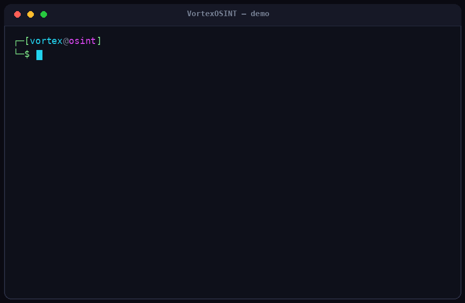

<div align="center">


# 🔍 VortexOSINT

**Toolkit OSINT modern, lengkap & 100% gratis** — investigasi *username*, *email*, *domain*, *IP*, *nomor telepon*, dan *metadata gambar* dari sumber publik tanpa API key berbayar.

[](LICENSE)
[](https://www.python.org/)
[](#)
[](#-akurasi)
[](#-plugin-komunitas)
[](CONTRIBUTING.md)

</div>

---

## 🎬 Demo

<div align="center">



*Pemindaian nomor telepon & ekstraksi EXIF/GPS gambar dengan ekspor PDF — langsung dari terminal.*

</div>

---

## ✨ Fitur

| Modul | Kemampuan | Sumber (gratis, tanpa API key) |
|-------|-----------|-------------------------------|
| 👤 **username** | Cek akun di **600+ platform** (dataset WhatsMyName) + **verifikasi anti-false-positive** & skor kepercayaan | WhatsMyName, profil publik |
| 📧 **email** | Validasi sintaks, **MX deliverability**, klasifikasi domain, **Gravatar**, **kebocoran data** & **infostealer** | Gravatar, XposedOrNot, HudsonRock, DNS |
| 🌐 **domain** | **WHOIS**, record **DNS**, enumerasi **subdomain**, sidik jari HTTP | crt.sh, DNS publik, WHOIS |
| 📡 **ip** | **Geolokasi konsensus 3 provider** + skor kesepakatan, ASN/ISP, reverse DNS, flag VPN/Proxy | ip-api, ipwho.is, ipapi.co |
| ☎️ **phone** | Validasi, operator, wilayah, zona waktu (offline) | Google libphonenumber |
| 📷 **image** | Ekstraksi **EXIF**, info kamera, **koordinat GPS** + link peta | Offline (Pillow) |

Plus:
- 🎯 **Akurasi tinggi** — deteksi tervalidasi, verifikasi false-positive, konsensus multi-sumber ([detail](#-akurasi))
- 🎨 Output terminal cantik dengan **rich** (otomatis fallback ke teks biasa)
- 📄 Ekspor laporan ke **JSON**, **HTML**, dan **PDF**
- 🖥️ **Mode interaktif (TUI)** berbasis menu — tanpa perlu hafal flag
- 🧩 **Sistem plugin komunitas** — tambah sumber data sendiri tanpa mengubah inti
- ⚡ Pemindaian **concurrent** (cepat)
- 🆓 **Tanpa biaya, tanpa API key wajib, sepenuhnya open source**

---

## 🎯 Akurasi

VortexOSINT dirancang untuk **meminimalkan false positive** dan memberi **skor kepercayaan** di setiap hasil:

- **Username** — menggunakan dataset **WhatsMyName** (600+ situs, masing-masing dengan aturan deteksi tervalidasi `e_string`/`e_code`). Setiap kandidat hasil **diverifikasi ulang dengan username kontrol acak**: situs yang juga "cocok" untuk username acak dianggap tidak andal dan dibuang. (Dataset di-cache 7 hari; fallback ke ruleset bawaan saat offline.)
- **IP** — **konsensus 3 provider** independen. Field yang disepakati mayoritas dilaporkan dengan persentase kesepakatan; koordinat dirata-ratakan antar provider yang sepakat. IP anycast otomatis ditandai kepercayaan rendah.
- **Email** — **validasi MX** memastikan domain benar-benar bisa menerima email (sinyal deliverability), dikombinasikan dengan Gravatar, breach, dan infostealer.
- **Phone** — parsing offline via Google libphonenumber (akurasi operator/wilayah tingkat pustaka resmi).

```bash
# username lebih cepat tapi kurang akurat (lewati verifikasi):
python vortex.py username johndoe --no-verify
# pakai ruleset bawaan, bukan WhatsMyName:
python vortex.py username johndoe --no-wmn
```

---

## 🚀 Instalasi

```bash
git clone https://github.com/0xgetz/VortexOSINT.git
cd VortexOSINT
pip install -r requirements.txt

# (opsional) install sebagai perintah global `vortex`
pip install -e .
```

> Butuh Python 3.8+. Semua dependensi gratis dan open source.

---

## 🧑‍💻 Penggunaan

```bash
# Cari username di 600+ situs (verifikasi akurasi otomatis)
python vortex.py username johndoe

# Investigasi email (MX + Gravatar + kebocoran data + infostealer)
python vortex.py email someone@example.com

# Recon domain (WHOIS, DNS, subdomain)
python vortex.py domain example.com

# Geolokasi IP (konsensus 3 provider)
python vortex.py ip 8.8.8.8

# Profil nomor telepon
python vortex.py phone "+6281234567890"
python vortex.py phone "081234567890" --region ID

# Ekstraksi metadata & GPS dari gambar
python vortex.py image /path/to/photo.jpg
```

### 🖥️ Mode interaktif

Tidak ingin menghafal perintah? Jalankan menu terpandu:

```bash
python vortex.py interactive
```

### 📄 Ekspor laporan (JSON / HTML / PDF)

```bash
# Simpan hasil ke beberapa format sekaligus
python vortex.py domain example.com --json --html --pdf

# Tentukan path keluaran sendiri
python vortex.py username johndoe --json hasil.json --pdf laporan.pdf
```

Jika diinstal via `pip install -e .`, gunakan perintah pendek `vortex`:

```bash
vortex ip 1.1.1.1 --pdf
```

---

## 🧩 Plugin komunitas

VortexOSINT bisa diperluas tanpa menyentuh kode inti. Buat file `.py` yang mengekspos fungsi `register()`:

```python
# ~/.vortexosint/plugins/myplugin.py
from vortexosint.core import console, http

def run(target, **_):
    console.section(f"My plugin: {target}")
    # ... logika Anda ...
    return {"target": target, "result": "..."}

def register():
    return {
        "command": "myplugin",
        "help": "Deskripsi singkat plugin saya",
        "args": [{"name": "target", "help": "Apa yang dicari"}],
        "run": run,
    }
```

Lalu:

```bash
python vortex.py plugins              # daftar plugin terpasang
python vortex.py myplugin nilai-target
```

Plugin dimuat dari `vortexosint/plugins/`, `~/.vortexosint/plugins/`, atau direktori di env `VORTEX_PLUGINS`.
Lihat contoh bawaan: [`example_macvendor.py`](vortexosint/plugins/example_macvendor.py).

---

## 📂 Struktur Proyek

```
VortexOSINT/
├── vortex.py                 # Peluncur CLI
├── vortexosint/
│   ├── cli.py                # Antarmuka baris perintah
│   ├── core/
│   │   ├── http.py           # Sesi HTTP + concurrency
│   │   ├── console.py        # Output rich/plaintext
│   │   ├── report.py         # Ekspor JSON/CSV/HTML/PDF
│   │   ├── interactive.py    # Mode interaktif (TUI)
│   │   └── plugins.py        # Loader plugin komunitas
│   ├── modules/
│   │   ├── username.py       # 600+ situs (WhatsMyName) + verifikasi FP
│   │   ├── email.py          # MX + Gravatar + breach + infostealer
│   │   ├── domain.py         # WHOIS/DNS/subdomain
│   │   ├── ip.py             # Geolokasi konsensus 3 provider
│   │   ├── phone.py          # Parsing nomor telepon
│   │   └── exif.py           # Metadata & GPS gambar
│   └── plugins/
│       └── example_macvendor.py  # Plugin contoh
├── assets/
│   ├── logo.jpeg             # Logo dark cyberpunk
│   └── demo.gif             # Animasi demo terminal
├── requirements.txt
├── setup.py
└── README.md
```

---

## 🗺️ Roadmap

- [x] Modul metadata gambar (EXIF)
- [x] Pencarian kebocoran kredensial tambahan (HudsonRock infostealer)
- [x] Mode interaktif (TUI)
- [x] Plugin sumber data komunitas
- [x] Ekspor PDF
- [x] Akurasi tinggi: WhatsMyName + verifikasi false-positive, konsensus IP multi-provider, validasi MX

🎉 **Semua item roadmap telah selesai!** Punya ide baru? Buka [issue](https://github.com/0xgetz/VortexOSINT/issues) atau kirim PR.

---

## ⚖️ Disclaimer Etika & Hukum

VortexOSINT dibuat **hanya untuk tujuan edukasi, riset keamanan, dan investigasi yang sah**.
Gunakan **hanya** pada target yang Anda miliki atau yang Anda punya izin eksplisit untuk diselidiki.
Seluruh data yang diakses bersifat **publik**. Penyalahgunaan untuk pelecehan, *stalking*, atau aktivitas ilegal **sepenuhnya menjadi tanggung jawab pengguna**. Penulis tidak bertanggung jawab atas penyalahgunaan.

---

## 📜 Lisensi

Dirilis di bawah [Lisensi MIT](LICENSE) — bebas digunakan, dimodifikasi, dan didistribusikan.

<div align="center">
Dibuat dengan ❤️ untuk komunitas OSINT — <strong>100% gratis selamanya</strong>.
</div>
